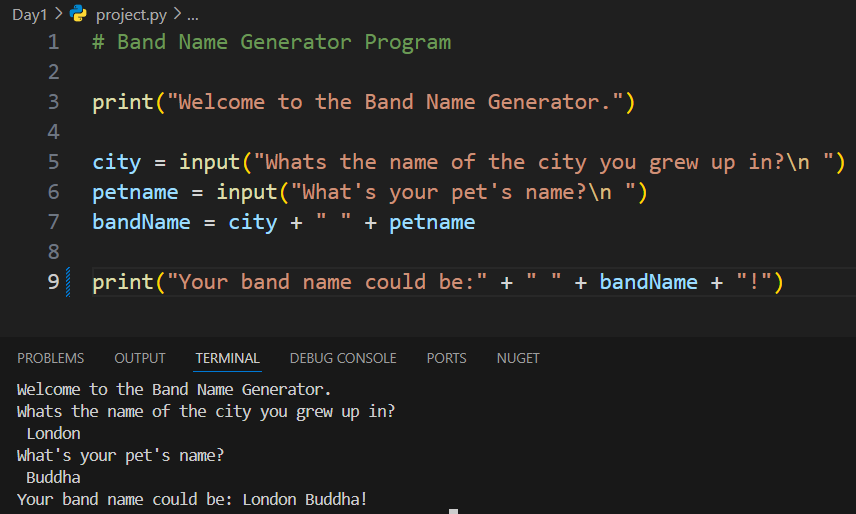

<h2><em>100 Days of Python Code...</em></h2>

<h2>Day 4:</h2> 
<h3>Project: Rock Paper Scissors</h3>

<h2>Day 3:</h2> 
<h3>Project: Treasure Island Adventure Game</h3>

<h2>Day 2:</h2> 
<h3>Project: Tip Calculator</h3>

<h2>Day 1:</h2> 
<h3>Project: Band Name Generator</h3>

